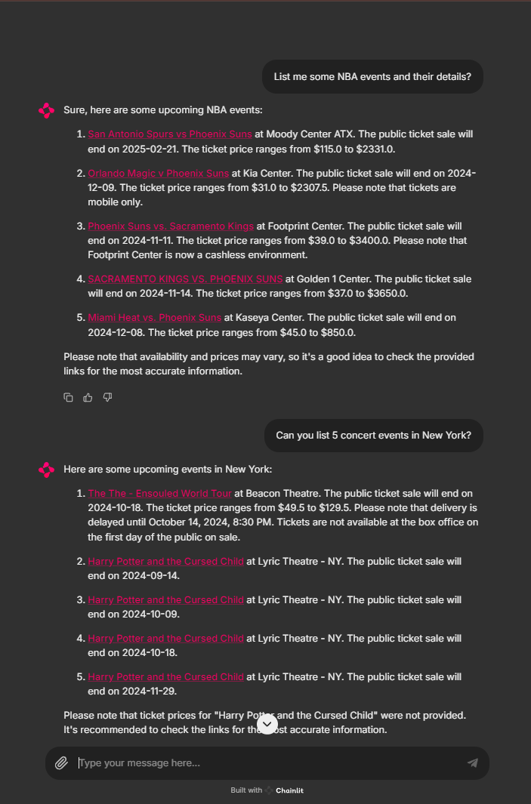

# Ticketmaster Agent
----

An AI agent that fetches data from "ticketmaster" and returns and answer.

## Architecture diagram


-------
## Setup

#### Local Development
Install uv on your machine with https://github.com/astral-sh/uv
```
uv venv --python 3.12
source .venv/bin/activate
uv pip install -r requirements.txt
```

To lock the requirements.in file
```
uv pip compile requirements.in -o requirements.txt
```

To add a new package
```
uv pip install <package_name>  
or
1. Add in requirements.in
2. uv pip compile requirements.in -o requirements.txt
3. uv pip install -r requirements.txt

```

#### Docker

```
docker compose up --build
```

#### Demo


